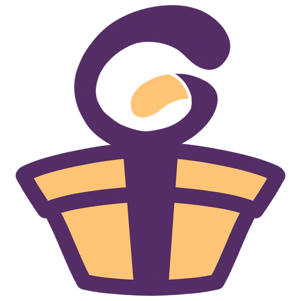
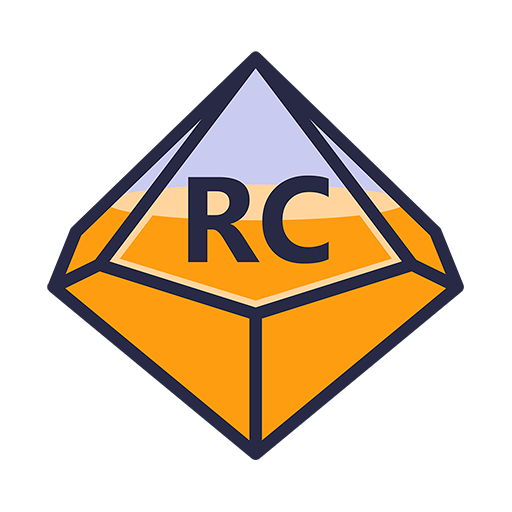
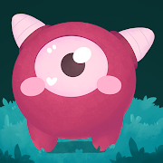

## Hi there 👋

I am a software developer working from Spain. I love web and video game development. And I'm starting in devops.

### About me

- 💼 Backend Engineer at [ Crowdfarming ](https://www.crowdfarming.com/es)

- 🌐 Web site: [victorreiner.com](https://victorreiner.com)

- ❤️ Love make little bots or automatizations with NodeJs.

- 🚀 Starting in Homelab and devops world.

- 💬 Ask me about anything [here](https://github.com/vmunozre/vmunozre/issues)

### Personal Projects

You can find my personal projects at my website [victorreiner.com](https://victorreiner.com). But here are some of my projects that I'm proud of:

- [ Guislis](https://guislis.com): Web to manage gift lists. Reserve gifts from friends. And make birthdays, Christmas and such events easier.
- [ Roll Counter](https://roll-counter.radiantequeflipas.com/): Small mobile oriented web application to facilitate the management of role counters in person.
- [ Roll Counter](https://victor-reiner.itch.io/inside-the-planet-full): Project born from a Ludum Dare. And evolved into a complete game.

### Public npm packages

| **Package** | **Version** | **Description** |
|:------------|:------------|:----------------|
| [**caos-js**](https://www.npmjs.com/package/caos-js) |  | "A small piece of code for those who want to watch the world burn" |

### Technologies

| **Area** |List|
|:--------------:|---|
| **Backend** |  |
| **Frontend**   |   |
| **Database**   |   |
| **Devops**     |      |
| **Videogames** |   |

<!--
**vmunozre/vmunozre** is a ✨ _special_ ✨ repository because its `README.md` (this file) appears on your GitHub profile.

Here are some ideas to get you started:

- 🔭 I’m currently working on ...
- 🌱 I’m currently learning ...
- 👯 I’m looking to collaborate on ...
- 🤔 I’m looking for help with ...
- 💬 Ask me about ...
- 📫 How to reach me: ...
- 😄 Pronouns: ...
- ⚡ Fun fact: ...
-->
